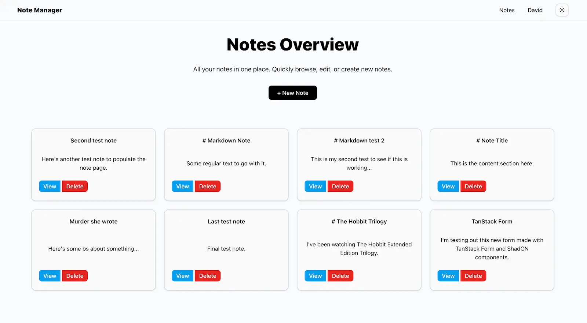
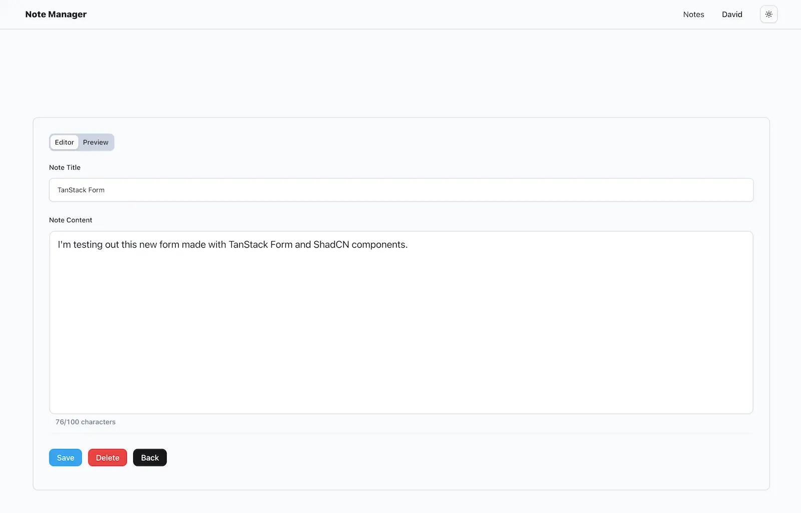

# Note Manager

Full-stack notes application demonstrating secure JWT authentication, rotating refresh tokens, and a monorepo architecture built with modern TypeScript tooling.

---

## Screenshots

<p align="center">
  
  <br />
  <em>Notes overview with protected route and authenticated session.</em>
</p>

<p align="center">
  
  <br />
  <em>Notes editor with validated form input and character counter.</em>
</p>

---

## Stack

### Backend
- Hono
- Prisma + PostgreSQL
- JWT (access tokens)
- Rotating refresh tokens (HttpOnly cookies)

### Frontend
- React + Vite
- TanStack Router
- TanStack Form
- Zustand
- Zod

### Tooling
- Bun
- Turborepo
- TypeScript

---

## Features

- Secure JWT authentication (short-lived access tokens)
- Rotating refresh tokens stored in HttpOnly cookies
- O(1) refresh token verification using indexed lookup hash
- Protected routes with client-side guards
- Full CRUD notes functionality
- Form validation (Zod + TanStack Form)
- Optimized auth flow (deduplicated refresh, non-blocking logout)
- Monorepo structure with shared types

---

## Authentication Architecture

- Access tokens expire in 15 minutes
- Refresh tokens are:
  - Random 64-byte values
  - Hashed with bcrypt before storage
  - Indexed via SHA-256 lookup hash
  - Rotated on every refresh
  - Revoked on logout
- Server verifies refresh tokens in constant time using indexed lookup
- Client stores only:
  - User metadata
  - Access token
- Refresh token stored as HttpOnly cookie (never accessible to JavaScript)

---

## Performance Optimizations

- Removed client-side polling wait loops
- Deduplicated concurrent refresh requests
- Eliminated dev proxy conflicts
- Indexed refresh token lookup to avoid full table scans
- Non-blocking logout flow
- Resolved Prisma client duplication for consistent performance

---

## Architecture

Monorepo structure:

```
client/   → React application  
server/   → Hono API  
shared/   → Shared types
```

---

## Running Locally

1. Install dependencies:
   ```
   bun install
   ```

2. Configure environment variables:
   ```
   cp .env.example .env
   ```

3. Run development server:
   ```
   bun run dev
   ```

---

## Project Focus

This project demonstrates:

- Production-style authentication patterns
- Secure token rotation and revocation
- Proper cookie security practices
- Clean separation of client and server responsibilities
- Real-world performance tuning and debugging
